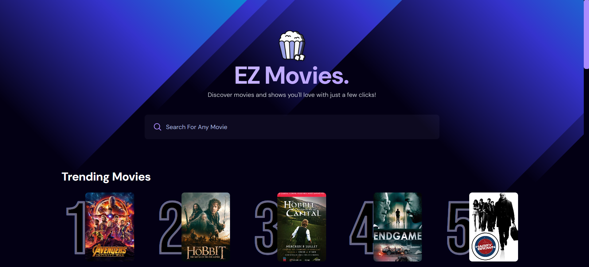

# 🎬 EZ Movies App

A modern movie browsing app built with **React** and powered by the **TMDB (The Movie Database)** API. Users can search for movies, explore trending content, and navigate through paginated movie results.

---

## 🚀 Features

- 🔍 **Live Search** with Debounce
- 📈 **Trending & Popular Movies**
- 🎞️ **Movie Posters & Titles**
- 📄 **Paginated Results Pages**
- 🌙 **Custom Theming with Tailwind CSS**
- ⚡ **Fast, responsive UI**
---

## 🛠️ Tech Stack

- **React** (Vite)
- **Tailwind CSS**
- **TMDB API** (for movie data)
- **FireStore (optional)** for trending database
- **Custom Hooks** (e.g., `useDebounce`)

---

## 🖼️ Screenshots

### Home Page -
> 

---

## 🔧 Setup & Installation

### 1. Clone the repo

```bash
git clone https://github.com/your-username/ez-movies-app.git
cd ez-movies-app 
```

### 2. Install dependencies
```bash
npm install
```

### 3. Get your TMDB API key

- Visit https://www.themoviedb.org

- Sign in and generate a new API key

### 4. Create a `.env.local` file
```bash
VITE_TMDB_API_KEY=your_tmdb_api_key_here
VITE_TMDB_BASE_URL=https://api.themoviedb.org/3
```
### 5. Start the development server
```bash
npm run dev
```
---

### 🧠 Folder Structure

```
src/
│
├── components/         # Reusable UI components (e.g. MovieCard, Pagination)
├── hooks/              # Custom hooks like useDebounce
├── index.css           # Tailwind and custom CSS
├── App.jsx             # Main app component
├── main.jsx            # Entry point
├── Firebase.js         # Firebase configuration (optional)
└── FirestoreService.js # Firestore service for trending movies (optional)
```
---

### 💻 Deployment

This app can be deployed via:

- GitHub Pages (Current Deployement)

- Vercel

- Netlify

- Firebase Hosting

---

### 🙋‍♂️ Author
- Banuka Janith
- GitHub: @Banukajanith2

### 📄 License
This project is licensed under the MIT License - see the [LICENSE](LICENSE) file for details.
